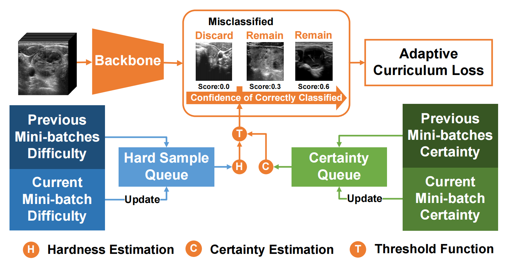
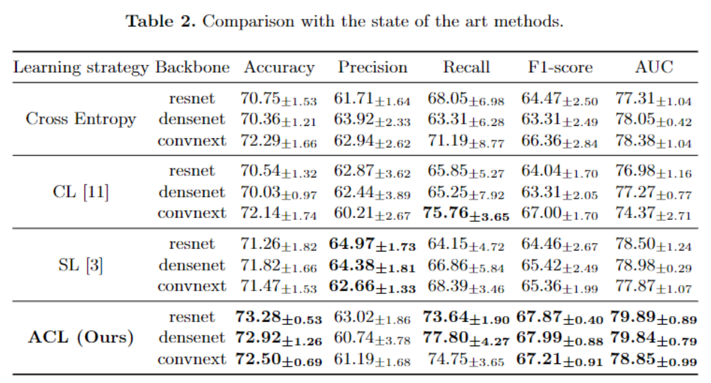

# Less is More: Adaptive Curriculum Learning for Thyroid Nodule Diagnosis [paper](https://arxiv.org/abs/2109.05159) 

### 25th International Conference on Medical Image Computing and Computer Assisted Intervention (MICCAI) with Student Travel Award

This repository is the official implementation of `ACL` for the binary classification task in Thyroid Nodule Diagnosis. In this paper, we propose a adaptive curriculum learning based method, ACL, to tackle with the inconsistent label problem. Specifically, ACL adaptively discovers and discards the samples with inconsistent labels via an adaptive threshold, calculated by the hard sample queue and the certainty queue.

Moreover, we contribute TNCD: a Thyroid Nodule Classification Dataset to facilitate future related research on the thyroid nodules. Extensive experimental results on TNCD based on three different backbone networks not only demonstrate the superiority of our method but also prove that the less-is-more principle which strategically discards the samples with Inconsistent Label could yield performance gains.


### Citation

Please cite this paper in your publications if it helps your research

```
@inproceeding{gong2022less,
  title={Less is More: Adaptive Curriculum Learning for Thyroid Nodule Diagnosis},
  author={Gong, Haifan and Cheng, Hui and Xie, Yifan and Tan, Shuangyi and Chen, Guanqi and Chen, Fei and Li, Guanbin},
  booktitle={MICCAI},
  year={2022}
}
```


Overview of the proposed adaptive curriculum learning framework. The orange part shows the training pipeline on a mini-batch. The hard sample estimation queue is shown in blue blocks, while the certainty estimation module is shown in green blocks.

### Prerequisites
CUDA					  11.2

torch                       1.11

torchvision			 0.12

### Getting Started

#### Installation

- Clone this repo:
```
git clone https://github.com/chenghui-666/ACL/
```
- Install necessary packages using `pip install -r requirements.txt` or `conda env create -f environment.yaml -n <your_env_name>`.

#### Dataset

The processed data should be downloaded via [Baidu Drive](https://pan.baidu.com/s/1_pcVYndjTcBaPmI3nb6ObQ) with the extract code: `eehb`. The trained models are available at [Baidu Drive](https://pan.baidu.com/s/19AZx2gUvsOvyJeDvOW2PTg) with extract code: `dp1w`.
Or you can download the data from [Google Drive](https://drive.google.com/drive/folders/1YtZGTb-AOmVk_uRZGWsT-pjK8hOAUix6?usp=sharing). 

The downloaded file should be extracted to `./datasets/`  directory.

### Training and Testing
1. Our method:

   ```shell
   sh acl_train.sh
   sh acl_inference.sh
   ```

2. Baselines:

   ```shell
   sh baseline.sh
   ```

3. Ablation study:

   ```shell
   sh ablation.sh
   ```

- The result csv file can be found in the file `./results.csv`.

### Comaprison with the sota



### License
MIT License

### Contact

haifangong@outlook.com

chenghui_123@foxmail.com

